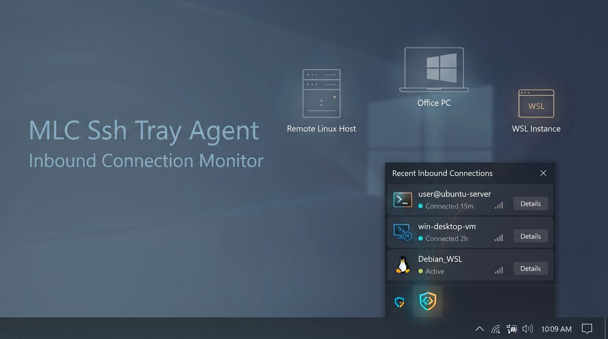

# MLC SSH Tray Agent



Small Windows tray monitor for active SSH, RDP, and optional WSL sessions.

Current version: `0.1.1`.

Licensed under the MIT License. Copyright Michael Lechner.

## Installation

The application is a portable Windows tray executable; no installer or
administrator rights are required for the common case.

1. Download the Windows executable from the GitLab pipeline artifacts or from
  the project's [GitHub Releases](https://github.com/hmsoft0815/mlcssystray/releases).
2. Extract `mlcsshtrayagent-windows-amd64.exe` for regular 64-bit Windows, or
  `mlcsshtrayagent-windows-arm64.exe` for Windows on ARM.
3. Start the executable. It runs in the notification area.

For automatic startup, create a shortcut to the executable in the Windows
startup folder (`shell:startup`). To remove the application, close it from the
tray menu and delete the executable.

## Usage

The tray menu shows active Windows OpenSSH, WSL-SSH, and RDP sessions, including
the user, source, and connection duration. A desktop notification is shown when
a new session appears. Use `About` / `Über` for the version, copyright, and
license information, and `Quit` / `Beenden` to stop the agent.

The interface follows the Windows display language and system theme when
available. Set `MLCSSHTRAY_LANG=en` or `MLCSSHTRAY_LANG=de` before starting the
executable to override the language.

## Motivation

Remote work can otherwise feel like flying blind: an SSH or RDP session may
remain active on another machine without being visible at a glance. This is
especially useful in environments with autonomous LLM agents, where tasks may
be delegated to different computers and sessions can outlive the person who
started them. The tray agent provides a small, immediate view of who is
currently connected and where.

Also check out [MLC Terminal](https://mlcgo.eu/products/terminal), a cross-platform,
multi-window SSH terminal.

## Status

This is an early MVP. The tray application currently provides:

- Windows OpenSSH session discovery through active TCP connections and the
  OpenSSH operational log.
- RDP session discovery through `quser`.
- WSL OpenSSH session discovery through active `sshd` processes.
- A tray count and session list.
- A desktop notification when a new session appears.
- Automatic German/English labels and a localized About dialog.
- Native Windows light/dark theme preference when supported by the OS.
- A clean no-op provider on non-Windows systems so the project remains
  testable there.

WSL session discovery is intentionally a separate provider. WSL is optional and
must not be a runtime dependency for the Windows build.

## Development

Requirements:

- Go 1.25+
- Task 3+
- Windows 10 or 11 for the application itself

```text
task test
task lint
task build
```

The Windows executable is written to `bin/mlcsshtrayagent.exe`.

GitLab CI runs the monitor tests and Windows vet, then publishes Windows
amd64 and arm64 executables as pipeline artifacts.

The monitor does not require administrator rights for the common case. Windows may hide ownership details for sessions belonging to another security context; the tray then reports the session as unknown rather than failing the whole monitor.
